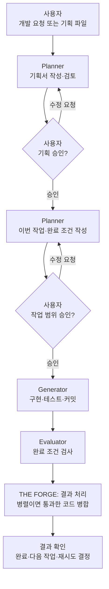
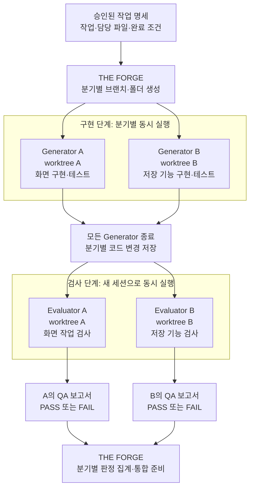
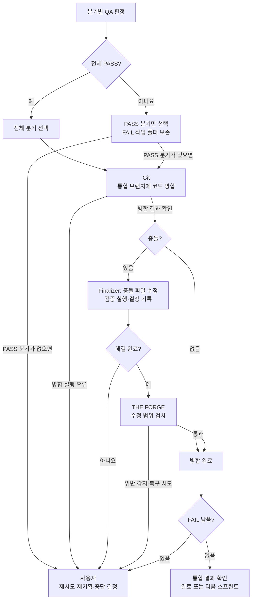

# THE FORGE


> **개발 요청을 작업 계획으로 바꾸고, AI의 구현과 검사를 역할별로 실행하는 도구.** Claude Code를 사용해 Planner가 작업을 정하고, Generator가 코드를 작성하고, Evaluator가 결과를 검사한다. 여러 작업은 독립 폴더에서 동시에 진행하고, 검사에 통과한 코드를 합친다. 사용자는 Slack 또는 Telegram에서 진행을 승인하거나 수정·중단을 요청한다.

---

## 빠른 시작

```bash
# 1) 설치 (한 번만)
git clone https://github.com/hwain-ai/THE_FORGE.git && cd THE_FORGE
uv sync && uv tool install .
# 코드 수정 후 재배포는: python scripts/deploy.py  (docs/DEV.md §4)

# 2) 알림 설정: Slack 또는 Telegram 토큰 입력 (한 번만)
forge setup

# 3) 내 프로젝트 초기화 (프로젝트마다 한 번)
cd /path/to/my-project && forge init

# 4) 실행
forge run "만들고 싶은 것"
```

사전 요구사항(로그인된 Claude Code CLI, uv, Slack Bot 또는 Telegram Bot): [USER_GUIDE 1절](./docs/USER_GUIDE.md#1-사전-요구사항--토큰-발급).

---

## 1. 무엇인가

THE FORGE는 개발 작업을 **기획 → 작업 명세 → 구현 → 검사 → 결과 처리** 순서로 진행한다. 이 순서를 관리하는 프로그램을 오케스트레이터라고 한다. 실제 파일 읽기·수정·테스트 실행은 Claude Code가 맡고, THE FORGE는 결과를 확인해 다음 작업을 시작하거나 사용자 결정을 기다린다.

예를 들어 사용자가 "할 일 관리 앱을 만들어줘"라고 요청하면, Planner가 필요한 기능과 완료 조건을 정한다. 사용자가 승인하면 Generator가 코드를 작성하고 Evaluator가 완료 조건을 검사한다. 여러 번에 나눠 개발할 때 각 작업 묶음을 **스프린트**라고 한다.

Claude Agent SDK에 의존하지 않는다. 기본 실행 경로는 Claude Code 로그인을 사용하도록 구성되어 있으며, 자식 프로세스 환경에서 `ANTHROPIC_API_KEY`와 `ANTHROPIC_AUTH_TOKEN`을 제거한다. 계정의 실제 이용 한도와 과금 조건은 사용하는 Claude Code 인증·구독 설정에 따른다.

---

## 2. 네 가지 설계 선택

이 프로젝트가 지금의 모습으로 나온 네 가지 결정.

### 2.1 Claude Code의 실행 기능 활용

Claude Code CLI(터미널에서 실행하는 Claude Code)의 도구 실행·대화 기록·컨텍스트 관리 기능을 사용하고, 그 위에 Python으로 역할별 실행 순서와 품질 검사(QA) 재시도 흐름을 얹는다. 각 실행은 `stream-json`(한 줄씩 주고받는 JSON 메시지)으로 연결해 작업 중에도 사용자 의견을 전달할 수 있다.

### 2.2 구현 담당과 검사 담당의 대화 분리

Planner·Generator·Evaluator는 호출마다 새 세션(대화 이력을 유지하는 실행 단위)에서 작업한다. Evaluator는 Generator의 대화 이력을 이어받지 않고 작업 명세·진행 기록·코드를 읽어 검사한다. 구현 담당이 내린 판단을 검사 담당이 그대로 이어받는 것을 줄이기 위한 구조다. 한 실행 안의 여러 도구 호출은 같은 세션에서 진행한다. [세션 경계 상세](#8-세션은-언제-새로-시작되는가).

### 2.3 파일 기반 통신

역할 간 작업 내용은 `artifacts/`의 문서와 Git에 남긴 코드로 전달한다. THE FORGE는 체크포인트(재시작에 사용할 진행 상태 기록)에 현재 단계와 분기 상태를 저장한다. Generator는 `progress-log.md`에 수행 내용을, Evaluator는 `qa-report.md`에 검사 결과를 남긴다. 다음 담당자는 이 파일들을 읽어 작업을 이어간다. 작업 중 사용자가 보낸 의견은 별도 메시지 파일에 저장해 실행 중인 담당자에게 전달한다.

### 2.4 원격 승인 게이트 (Slack / Telegram)

Generator가 코드를 짜는 동안은 자율이지만, **방향 전환 결정은 사람이 한다**. 기획 검토, **매 스프린트의 작업 명세 승인**, 검사 실패 시 재시도·재검사 선택에서 사용자 판단을 받는다. Slack은 버튼·분기 검토 카드·질문 카드·작업 중 의견 전달을 지원하고, Telegram은 메시지 명령을 지원한다. 사용할 수 있는 명령은 현재 승인 단계와 알림 채널에 따라 다르다.

---

## 3. 작업은 어떻게 진행되는가

### 3.1 역할과 전체 흐름

| 담당 | 실제로 하는 일 | 남기는 결과 |
|---|---|---|
| **사용자** | 목표를 제시하고, 계획·작업 범위·재시도 여부를 결정 | 승인 또는 수정 지시 |
| **Planner: 계획 담당** | 요청을 기능으로 정리하고, 이번 스프린트의 작업과 완료 조건을 작성 | 기획서, 작업 명세, 분기별 작업 범위 |
| **Generator: 구현 담당** | 맡은 파일을 수정하고 테스트를 실행하며 변경 사항을 커밋 | 코드와 진행 기록 |
| **Evaluator: 검사 담당** | 작업 명세의 완료 조건을 기준으로 구현 결과를 검사 | QA 보고서와 PASS·FAIL 판정 |
| **Finalizer: 충돌 해결 담당** | 분기 코드를 합칠 때 충돌이 생기면 해결하고 검증 | 충돌 해결 코드와 결정 기록 |
| **THE FORGE: 실행 관리자** | 위 역할을 순서대로 실행하고, 작업 폴더·승인 대기·결과 합치기를 관리 | 단계별 진행 상태 |

아래는 한 스프린트의 기본 흐름이다. **PASS는 검사 통과, FAIL은 수정이나 재검토가 필요한 상태**를 뜻한다. 여러 분기로 나눠 실행하는 경우의 구현·검사·통합 과정은 다음 그림에서 자세히 설명한다.



사용자는 처음 기획을 검토하고, **매 스프린트의 작업 명세를 승인**한다. Slack의 분기 검토 카드에서는 작업별로 유지·제외·수정을 선택할 수 있다. 작업 도중 방향을 바꾸려면 `/revise`, 다음 단계로 진행하려면 해당 승인 화면에서 `/resume`을 사용한다.

### 3.2 병렬 분기: 서로의 파일을 덮어쓰지 않고 작업하기

**분기**는 전체 작업에서 떼어 맡긴 작업 단위다. Planner는 작업 명세에 분기별 작업과 담당 파일을 적는다. THE FORGE는 각 분기에 **Git 브랜치(변경 이력)**와 **Git worktree(그 브랜치의 파일을 펼쳐 놓은 독립 폴더)**를 만든다. Generator들은 같은 프로젝트를 서로 다른 폴더에서 수정하므로 작업 중 파일이 바로 섞이지 않는다.

예를 들어 "할 일 관리 앱"을 **화면 작업 A**와 **저장 기능 작업 B**로 나눴다고 가정하자. 아래 두 분기는 설명을 위한 예시이며, 실제 분기는 Planner가 작성한 작업 명세에 따른다.



1. **작업 준비:** THE FORGE가 같은 시작 코드에서 분기별 worktree를 만든다.
2. **병렬 구현:** Generator가 각 폴더에서 자기 작업을 수행한다. 각 Generator는 독립 세션을 사용한다.
3. **병렬 검사:** 모든 Generator가 종료되면 Evaluator들을 실행한다. 각 Evaluator는 담당 분기의 코드와 완료 조건을 읽고 QA 보고서를 남긴다.
4. **결과 집계:** THE FORGE가 분기별 PASS·FAIL을 확인하고 합칠 코드를 결정한다.

병렬 실행은 작업 명세의 `Parallel Task Graph`(분기별 작업 목록)에 여러 분기가 있을 때 사용한다. 기본 분기 상한은 **4개**이며, 명세의 분기 수를 설정한 상한 안에서 구성한다. 분기 정의가 없거나 병렬 상한을 `1`로 설정하면 단일 실행으로 진행한다.

### 3.3 결과 통합: 통과한 코드를 합치고 충돌 해결하기

**병합(merge)**은 분기에서 만든 변경 사항을 원래 작업 브랜치에 합치는 과정이다. 여기서는 결과를 모으는 원래 브랜치를 **통합 브랜치(trunk)**라고 부른다. 같은 파일의 변경을 Git이 자동으로 합칠 수 없으면 **충돌(conflict)**이 발생한다.

THE FORGE는 먼저 Git으로 병합한다. **충돌이 있을 때 Finalizer를 별도 AI 세션으로 실행**한다.



Finalizer의 작업 범위는 **충돌이 발생한 파일 안의 통합 작업**이다. 두 분기의 변경을 함께 살리는 코드를 작성할 수 있고, 그 경우 빌드·코드 로딩·테스트 등 필요한 검증을 실행하도록 지침을 둔다. 기존 QA 판정을 고치거나 분기에 없던 새 기능을 추가하는 역할은 아니다.

| 검사·병합 결과 | 이후 처리 |
|---|---|
| 모든 분기가 PASS이고 병합 성공 | 분기 작업 폴더를 정리하고, 통합 결과 확인 후 완료하거나 다음 스프린트 진행 |
| 일부 분기만 PASS | 통과한 분기의 병합을 시도하고, 실패한 분기 폴더를 보존해 재기획·재시도 판단에 사용 |
| 모든 분기가 FAIL | 코드를 합치지 않고 사용자 결정 대기 |
| 충돌 해결 실패 또는 수정 범위 위반 | 사용자에게 알리고 후속 결정 대기. 범위 위반을 감지하면 병합 결과 되돌리기 시도 |

일부 분기가 실패하면 사용자는 계속 진행하거나 건너뛰거나 중단할 수 있다. 계속 진행하는 경로에서는 Planner가 실패 내용을 읽고 작업 분할을 다시 검토한다. 병렬 실행의 `/eval`도 이 재기획 경로로 연결된다. 단일 실행에서 Evaluator만 다시 호출하는 `/eval`과 동작이 다르다.

Slack 통합 승인 카드가 발송되는 경우 사용자는 **병합된 결과를 확인한 뒤** 완료 또는 다음 스프린트 진행을 결정한다. 이 확인은 Git 병합 이후에 이루어진다.

### 3.4 작업 기록은 어디에 남는가

새 담당자는 이전 담당자의 대화를 공유받는 대신 아래 파일과 Git 기록을 읽는다. `artifacts/`는 계획·진행 상황·검사 결과를 모으는 폴더다.

| 위치 | 내용 | 주로 작성하는 담당 |
|---|---|---|
| `artifacts/spec.md` | 전체 개발 목표와 요구사항 | Planner |
| `artifacts/sprint-contract.md` | 이번 작업, 담당 파일, 완료 조건 | Planner |
| `artifacts/sprint-capabilities.md` | 사용자가 검토할 분기별 작업 설명 | Planner |
| `artifacts/progress-log.md` | 단일 실행의 진행 기록 | Generator |
| `artifacts/qa-report.md` | 단일 실행의 검사 결과 | Evaluator |
| `artifacts/branches/<분기 ID>/` | 병렬 분기의 진행 기록·QA 보고서 | 해당 Generator·Evaluator |
| `.worktrees/sprint-<번호>-<분기 ID>/` | 분기별 실제 코드 작업 폴더 | THE FORGE가 생성 |
| `artifacts/.harness-checkpoint` | 현재 실행 단계와 분기 상태 | THE FORGE |

`forge journal`을 실행하면 별도 **Journal 담당**이 개발 기록을 읽고 `docs/journal.md`에 사람이 읽을 수 있는 저널을 작성한다.

---

## 4. 현재 지원 기능

- **스프린트 반복:** 작업 명세의 `has_next_sprint` 값으로 다음 스프린트 유무를 확인한다. `--single-sprint`로 한 스프린트만 실행할 수 있다.
- **병렬 구현·검사·통합:** 분기별 worktree에서 구현과 검사를 수행하고, 통과한 코드를 합친다. 충돌 시 Finalizer가 해결을 맡는다.
- **작업 중 의견 전달:** 연결된 실행에서는 AI의 질문 카드(`ASK_USER`)에 답하거나 Slack 메시지로 의견을 전달할 수 있다. 의견은 실행 중인 세션에 추가된다.
- **원격 상태 확인과 수정 요청:** Slack의 `/forge-status [project_name]`으로 실행 상태를 확인하고, `/revise` 입력 창에서 기획 수정 지시를 보낸다.
- **역할별 지침 관리:** `forge init`이 에이전트 정의와 상세 지침을 프로젝트에 복사한다. `forge update-agents`와 `forge update-agent-knowledge`로 각각 갱신한다.
- **실행 한도 설정:** 스프린트 수, 누적 기록 시간, 연속 FAIL 횟수에 따라 실행 루프를 중단하도록 설정할 수 있다.

---

## 5. 설치 & 실행

### 사전 요구사항

- **Python 3.12+**, **uv**, **로그인된 Claude Code CLI**, **Git**
- 원격 제어: **Slack Bot** (권장) 또는 **Telegram Bot** 중 하나
- 선택: **Node.js 18+** (Playwright E2E), **Langfuse 계정** (LLM 트레이싱)

상세 토큰 발급 절차: [USER_GUIDE 1.3](./docs/USER_GUIDE.md#13-토큰-발급-절차).

### 실행 패턴 3가지

```bash
# 패턴 A — 짧은 요청 (spec.md 없이)
forge run "LangGraph 기반 대화 에이전트 뼈대 만들어줘"

# 패턴 B — 기획서 파일로 시작
forge run --plan ./my-plan.md

# 패턴 C — 크래시 후 자동 복구 (체크포인트가 있으면 인자 불필요)
forge run
```

각 패턴의 내부 동작, `--from PHASE` 강제 재진입, 원격 제어 명령 전체: [USER_GUIDE 6절](./docs/USER_GUIDE.md#6-forge-run--실행의-모든-것).

---

## 6. CLI 요약

11개 명령. 현재 옵션은 `forge --help` 또는 [CLI 구현](./src/forge/cli.py)에서 확인할 수 있다.

| 명령 | 한 줄 설명 |
|---|---|
| `forge run [요청]` | 기획부터 구현·검사까지 스프린트 실행 |
| `forge eval` | Evaluator만 재실행 |
| `forge status` | 현재 단계와 누적 시간 조회 |
| `forge setup` | 공통 알림 설정 |
| `forge init` | 프로젝트에 실행 지침·문서 양식 복사 |
| `forge journal` | 개발 기록을 저널로 정리 |
| `forge update-templates` | 문서 양식 갱신 |
| `forge update-agents` | 에이전트 정의 갱신 |
| `forge update-agent-knowledge` | 역할별 상세 지침 최신화 |
| `forge notify TYPE MSG [FILE]` | Hooks용 일회성 알림 |
| `forge version` | 버전 출력 |

---

## 7. 설정 요약

`forge setup`은 여러 프로젝트에서 공유할 알림 설정을 `~/.forge/config.env`에 저장한다. 프로젝트별 값은 `.env`, `pyproject.toml`의 `[tool.forge]`, 또는 `forge.toml`의 `[forge]`에 작성할 수 있다. 실행할 때 지정한 비어 있지 않은 `FORGE_*` 환경 변수는 같은 이름의 TOML 설정보다 우선한다.

아래 표는 프로젝트 설정을 적용하기 전의 내장 기본값이다. 전체 필드와 세부 적용 규칙은 [ForgeConfig](./src/forge/config.py)에서 확인할 수 있다.

**자주 쓰는 키**:

| 키 | 기본값 | 설명 |
|---|---|---|
| `FORGE_NOTIFIER_BACKEND` | `telegram` | `slack` 또는 `telegram` |
| `FORGE_SLACK_BOT_TOKEN` / `_APP_TOKEN` / `_CHANNEL` | — | Slack 3종 |
| `FORGE_TELEGRAM_BOT_TOKEN` / `_CHAT_ID` | — | Telegram 2종 |
| `FORGE_PLANNER_MAX_TURNS` / `FORGE_PLANNER_REVIEW_MAX_TURNS` / `FORGE_CONTRACT_MAX_TURNS` | 각각 `200` | Planner 실행별 턴 상한 |
| `FORGE_GENERATOR_MAX_TURNS` / `FORGE_EVALUATOR_MAX_TURNS` | 각각 `500` | Generator·Evaluator 실행별 턴 상한 |
| `FORGE_MAX_PARALLEL_BRANCHES` | `4` | 병렬 분기 상한, 허용 범위 1~4 |
| `FORGE_BRANCH_FAIL_ESCALATE_THRESHOLD` | `2` | 분기 연속 실패 시 재기획 검토 기준 |
| `FORGE_MAX_CONSECUTIVE_FAILS` | `0` | 0이면 연속 FAIL 자동 중단 비활성 |
| `FORGE_MAX_TOTAL_SPRINTS` / `FORGE_MAX_TOTAL_MINUTES` | `20` / `1440` | 실행 루프의 스프린트 수·누적 시간 한도 |
| `FORGE_LANGFUSE_PUBLIC_KEY` / `_SECRET_KEY` | — | 선택, 비어있으면 no-op |

스프린트 수·누적 시간 한도는 실행 루프의 다음 반복을 시작할 때 확인한다. 설정 예시는 [USER_GUIDE 5.3](./docs/USER_GUIDE.md#53-모든-forge_-환경-변수) 참조.

---

## 8. 세션은 언제 새로 시작되는가

**기준은 도구 호출 횟수가 아니라 THE FORGE가 에이전트를 새로 실행하는 시점이다.** 여기서 세션은 하나의 Claude Code 프로세스가 유지하는 대화 이력이다.

| 상황 | 세션 동작 |
|---|---|
| Generator가 파일 읽기 → 수정 → 테스트 → 재수정 | 한 번의 Generator 실행 안에서 같은 세션 유지 |
| 실행 중 질문 응답·사용자 의견 전달 | 실행 중인 세션에 메시지 추가 |
| Planner의 기획 생성·검토·수정·작업 명세 작성 | 각 호출마다 새 세션 |
| Generator 종료 후 Evaluator 실행 | 별도 새 세션 |
| QA FAIL 후 `/resume`으로 Generator 재실행 | 같은 스프린트여도 새 세션 |
| 단일 실행의 `/eval` 또는 Evaluator 자동 재시도 | 새 Evaluator 세션 |
| 병렬 실행 실패 후 `/resume` 또는 `/eval` | Planner 재기획 호출과 이후 실행에서 새 세션 |
| 다음 스프린트 | Planner 작업 명세 작성부터 새 호출별 세션 |
| 여러 분기 병렬 실행 | 분기마다 독립 Generator 세션, 이후 독립 Evaluator 세션 |
| 병합 충돌로 Finalizer 실행 | 별도 새 세션 |
| 프로세스 중단 후 `forge run` 재시작 | 체크포인트로 실행 단계를 결정하고, 필요한 에이전트를 새 세션으로 호출 |

예를 들어 단일 분기에서 처음 기획부터 시작하면 보통 **Planner 기획 세션 → Planner 작업 명세 세션 → Generator 세션 → Evaluator 세션** 순서다. Generator가 이 안에서 파일을 20번 읽고 테스트를 5번 실행해도, 그 도구 호출 자체가 새 Generator 세션을 만들지는 않는다. FAIL 수정이나 기획 수정이 있으면 세션 수가 더 늘어난다.

### 세션 종료와 컨텍스트 한도

- 실행기는 CLI의 `result`(실행 결과), `error`(오류), 출력 종료를 만나면 실행을 마무리하고 프로세스를 닫는다. `--max-turns`에는 Generator 기준 내장 기본값 `500`을 전달한다. 이는 실행 턴 상한이며, 도구 한 번마다 세션을 교체하는 설정이 아니다.
- Claude Code의 **컴팩션**은 긴 대화 내용을 요약해 이어가는 기능이다. THE FORGE는 컴팩션 이벤트를 이유로 세션 ID를 바꾸지 않는다. [Claude Code 동작 설명](https://code.claude.com/docs/en/how-claude-code-works).
- [Generator 지침](./scaffold/agent-knowledge/generator/procedure.md)은 대화가 길어져 작업을 마무리해야 할 때 진행 기록과 커밋을 남기도록 정한다. 단일 실행에서는 Generator 종료 후 Evaluator로 이동하고, FAIL이면 사용자 재시도 결정으로 새 Generator를 실행한다.
- Generator가 서브에이전트(하위 작업 담당 AI)에 위임하면 **별도 대화 공간**에서 하위 작업을 처리한다. 부모 Generator 세션은 유지된다. [공식 서브에이전트 설명](https://code.claude.com/docs/en/sub-agents).

### 재시작할 때 무엇이 이어지는가

**작업 내용은 파일과 Git 기록으로 이어진다.** THE FORGE는 체크포인트에서 실행 단계를 확인하고 필요한 담당자를 새 세션으로 호출한다. 새 Generator는 진행 기록 → 기획서 → 작업 명세 → QA 결과 → 최근 Git 기록을 읽는다.

Slack/Telegram의 `/resume`은 **작업 진행 승인**을 뜻한다. Claude CLI의 `--resume`은 **이전 대화 재개**를 뜻하므로 두 명령을 구분한다. 실행 구조는 [세션 관리](./src/forge/agents/cli_session.py)와 [실행기](./src/forge/agents/runner.py)에서 확인할 수 있다.

---

## 9. 문서 안내

| 문서 | 대상 | 내용 |
|---|---|---|
| [docs/USER_GUIDE.md](./docs/USER_GUIDE.md) | 사용자 | 설치·실행·설정·트러블슈팅·복구 시나리오 전체 |
| [docs/DEV.md](./docs/DEV.md) | 기여자 | 테스트·린트·재배포(`python scripts/deploy.py`)·코드 레퍼런스 |
| [docs/핵심기술.md](./docs/핵심기술.md) | 설계 심화 | 아키텍처 내부 설계 · 결정 배경 |
| [docs/parallel-branches-design.md](./docs/parallel-branches-design.md) | 설계 참고 | 병렬 분기·평가·병합 설계 |
| [docs/plan-judgment-velocity.md](./docs/plan-judgment-velocity.md) | 설계 참고 | 질문 카드·사용자 의견 전달·세션 설계안 |

막힌 에러가 있다면 [USER_GUIDE 에러 빠른 찾기](./docs/USER_GUIDE.md#에러-빠른-찾기) 표에서 메시지로 검색.

---
