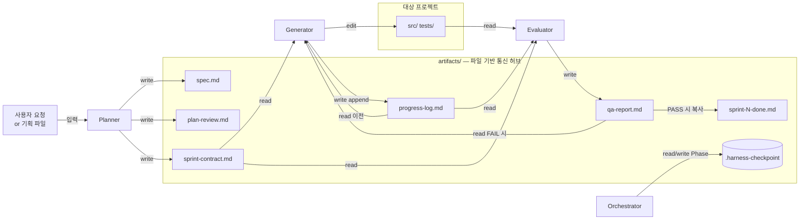
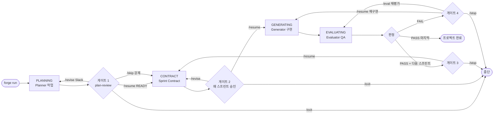

# THE FORGE


> Claude Code CLI 위에 얹는 **5단계 개발 오케스트레이터**. Planner가 작업을 정하고, Generator가 구현하고, Evaluator가 검사하는 스프린트(작업 묶음)를 반복한다. Slack 또는 Telegram으로 승인·수정·중단을 제어하며, 여러 분기는 별도 작업 폴더에서 병렬로 실행할 수 있다.

패키지 버전은 `pyproject.toml`의 **2.3.4** 기준이다. 현재 `forge version`은 `src/forge/__init__.py`의 별도 상수 **2.3.0**을 출력하므로 두 표시가 일치하지 않는다.

---

## 60초 시작

```bash
# 1) 설치 (한 번만)
git clone https://github.com/immortal0900/THE_FORGE.git && cd THE_FORGE
uv sync && uv tool install .
# 코드 수정 후 재배포는: python scripts/deploy.py  (docs/DEV.md §4)

# 2) 전역 설정 마법사 — Slack 또는 Telegram 토큰 입력 (한 번만)
forge setup

# 3) 내 프로젝트 초기화 (프로젝트마다 한 번)
cd /path/to/my-project && forge init

# 4) 실행
forge run "만들고 싶은 것"
```

사전 요구사항(로그인된 Claude Code CLI, uv, Slack Bot 또는 Telegram Bot): [USER_GUIDE 1절](./docs/USER_GUIDE.md#1-사전-요구사항--토큰-발급).

---

## 1. 무엇인가

THE FORGE는 **공식 `claude` CLI를 별도 프로세스로 실행**하고, 기획 → 작업 명세 → 구현 → 평가 → 결과 처리의 순서를 제어한다. 실제 파일 읽기·수정·테스트 실행은 Claude Code가 맡고, THE FORGE는 결과 파일을 확인해 다음 단계나 사용자 승인 대기로 이동한다.

Claude Agent SDK에 의존하지 않는다. 기본 실행 경로는 Claude Code 로그인을 사용하도록 구성되어 있으며, 자식 프로세스 환경에서 `ANTHROPIC_API_KEY`와 `ANTHROPIC_AUTH_TOKEN`을 제거한다. 계정의 실제 이용 한도와 과금 조건은 사용하는 Claude Code 인증·구독 설정에 따른다.

---

## 2. 네 가지 설계 선택

이 프로젝트가 지금의 모습으로 나온 네 가지 결정.

### 2.1 harness-over-harness

Claude Code CLI의 도구 실행·대화 기록·컨텍스트 관리 기능을 사용하고, 그 위에 Python으로 역할별 실행 순서와 QA 재시도 흐름을 얹는다. 각 실행은 `stream-json`(한 줄씩 주고받는 JSON 메시지)으로 연결해 작업 중에도 사용자 의견을 전달할 수 있다.

### 2.2 호출마다 프로세스와 세션 분리 (역할 격리)

Planner·Generator·Evaluator를 호출할 때마다 별도 프로세스와 새 세션 ID를 만든다. Evaluator는 Generator의 대화 이력을 이어받지 않고 작업 명세·진행 기록·코드를 읽어 평가한다. 이는 구현 과정의 판단이 평가에 그대로 이어지는 것을 줄이기 위한 구조이며, 평가의 정확성 자체를 보장하지는 않는다. 한 실행 안의 여러 도구 호출은 같은 세션에서 진행한다. [세션 경계 상세](#8-세션은-언제-새로-시작되는가).

### 2.3 파일 기반 통신

역할 간 작업 내용은 `artifacts/`의 문서와 Git에 남긴 코드로 전달한다. 대화 이력은 직접 공유하지 않는다. 체크포인트에는 진행 단계와 분기 상태를 저장하고, `progress-log.md`에는 수행 내용, `qa-report.md`에는 평가 결과를 남긴다. 다음 실행은 이 파일들을 읽어 작업을 이어간다. 작업 중 사용자 의견을 전달하는 JSONL 큐도 있지만, 이전 에이전트의 대화를 복원하는 용도는 아니다.

### 2.4 원격 승인 게이트 (Slack / Telegram)

Generator가 코드를 짜는 동안은 자율이지만, **방향 전환 결정은 사람이 한다**. PLANNING 완료 후의 기획 검토, **매 스프린트의 CONTRACT 승인**, QA FAIL 시 재시도/재평가 선택에서 사용자 판단을 받는다. Slack은 버튼·분기 검토 카드·질문 카드·작업 중 의견 전달을 지원하고, Telegram은 메시지 명령을 지원한다. 가능한 명령은 현재 게이트와 알림 백엔드에 따라 다르다.

---

## 3. 아키텍처

두 가지 시점으로 나눠 표현한다.

### 3.1 에이전트 I/O 흐름 (무엇을 읽고 무엇을 쓰는가)



- **Planner** 입력: 사용자 요청 또는 `--plan FILE`. 출력: `spec.md`, `plan-review.md`, `sprint-contract.md`.
- **Generator** 입력: `sprint-contract.md` + 이전 `progress-log.md` + (FAIL 시) `qa-report.md`. 출력: `progress-log.md` append + 실제 소스 편집.
- **Evaluator** 입력: `sprint-contract.md` + `progress-log.md` + 소스 코드. 출력: `qa-report.md` 단 하나.
- 역할 간 대화 이력을 직접 전달하지 않고, `artifacts/` 문서와 저장된 코드·Git 기록을 읽어 이어간다.

위 그림은 단일 분기 기준이다. 병렬 실행 시 Planner는 `sprint-capabilities.md`(분기 검토 카드 데이터)도 작성하고, Generator·Evaluator는 분기마다 별도 세션과 Git worktree(독립 작업 폴더)를 사용한다. 분기 기록은 `artifacts/branches/<분기 ID>/`에 저장한다. 통과한 분기를 합칠 때 충돌이 있으면 **Finalizer**를 별도 세션으로 호출한다. Finalizer는 충돌 파일 안에서 통합 코드를 작성할 수 있으며 검증이 필요하다. **Journal**은 `forge journal` 명령으로 실행하는 별도 기록 역할이다.

### 3.2 사용자 시간순 의사결정 (언제 어떤 선택을 하는가)



- **자동 전이**: 승인받은 작업 명세로 Generator가 구현하고, 종료 후 Evaluator가 검사한다. 기획·작업 명세 승인 대기는 별도로 거친다.
- **게이트 1**: `plan-review.md` 상태가 `NEEDS_REVISION`이면 `/resume`이 막히고 `/skip`만 강제 진행시킨다.
- **게이트 2**: 매 스프린트의 CONTRACT 완료 후 승인받는다. 분기 검토 카드가 발송되면 keep/drop/revise 결정을 받고, 제외·수정 요청은 Planner의 수정 및 작업 명세 재생성으로 연결한다.
- **명령어 채널**: Slack 버튼 · Slash Command · Telegram 메시지 · 시그널 파일(`touch artifacts/.approval-signal`) · 터미널 Enter 중 아무거나.

---

## 4. 현재 지원 기능

- **스프린트 반복** — `sprint-contract.md`의 `has_next_sprint` 플래그로 다음 스프린트를 결정하고 승인 게이트를 거쳐 실행. `--single-sprint`로 한 스프린트만 실행.
- **병렬 구현·평가** — 작업 명세의 `Parallel Task Graph`에 여러 분기가 있으면 분기별 Generator와 Evaluator를 실행. 동시 분기 기본 상한은 4이며, 분기 정의가 없으면 단일 실행. 카드 개수만으로 병렬 실행 여부가 결정되지는 않는다. 현재 코드는 상한을 넘는 분기를 다음 차례로 예약하지 않고 앞 N개만 실행하므로 명세를 상한 안에서 작성해야 한다.
- **작업 중 의사소통** — 연결된 실행에서는 `ASK_USER` 응답과 Slack 평문 의견을 실행 중인 세션에 전달. 매 의견마다 세션을 새로 만들지 않는다.
- **Slack Slash Commands** — `/forge-status [project_name]`으로 실행 중 프로세스 조회, `/revise` 모달로 spec.md 수정 지시 입력.
- **`forge setup` 전역 마법사** — `~/.forge/config.env`를 생성해 Slack/Telegram 토큰을 전역 공유. Slack이 기본값.
- **`forge journal`** — 스프린트 히스토리를 `docs/journal.md`로 누적 (범위: `--sprint`, `--sprints`, `--since`).
- **역할별 지침 분리** — `.claude/agents/*.md`가 상황에 맞는 `.claude/agent-knowledge/` 문서를 읽도록 구성. `forge init`이 함께 복사하며, `forge update-agents`·`forge update-agent-knowledge`로 각각 갱신. 템플릿은 `forge update-templates`로 갱신.
- **실행 한도** — 누적 스프린트 한도(`FORGE_MAX_TOTAL_SPRINTS`), 누적 시간 한도(`FORGE_MAX_TOTAL_MINUTES`), 선택적인 연속 FAIL 한도(`FORGE_MAX_CONSECUTIVE_FAILS`)를 확인. 연속 FAIL 기본값은 `0`으로 자동 중단이 비활성화되어 있다.

---

## 5. 설치 & 실행

### 사전 요구사항

- **Python 3.12+**, **uv**, **로그인된 Claude Code CLI**, **Git**
- 원격 제어: **Slack Bot** (권장) 또는 **Telegram Bot** 중 하나
- 선택: **Node.js 18+** (Playwright E2E), **Langfuse 계정** (LLM 트레이싱)

상세 토큰 발급 절차: [USER_GUIDE 1.3](./docs/USER_GUIDE.md#13-토큰-발급-절차).

### 실행 패턴 3가지

```bash
# 패턴 A — 짧은 요청 (spec.md 없이)
forge run "LangGraph 기반 대화 에이전트 뼈대 만들어줘"

# 패턴 B — 기획서 파일로 시작
forge run --plan ./my-plan.md

# 패턴 C — 크래시 후 자동 복구 (체크포인트가 있으면 인자 불필요)
forge run
```

각 패턴의 내부 동작, `--from PHASE` 강제 재진입, 원격 제어 명령 전체: [USER_GUIDE 6절](./docs/USER_GUIDE.md#6-forge-run--실행의-모든-것).

---

## 6. CLI 요약

11개 명령. 현재 옵션은 `forge --help` 또는 [CLI 구현](./src/forge/cli.py)에서 확인할 수 있다.

| 명령 | 한 줄 설명 |
|---|---|
| `forge run [요청]` | 5-Phase 스프린트 루프 (자동 다음 스프린트 지원) |
| `forge eval` | Evaluator만 재실행 |
| `forge status` | 현재 체크포인트/Phase/누적시간 조회 |
| `forge setup` | 전역 설정 마법사 *(v2.3)* |
| `forge init` | 프로젝트 scaffold 복사 |
| `forge journal` | 엔지니어링 저널 누적 *(v2.3)* |
| `forge update-templates` | scaffold/templates 최신화 *(v2.3)* |
| `forge update-agents` | scaffold/agents 최신화 *(v2.3)* |
| `forge update-agent-knowledge` | 역할별 상세 지침 최신화 |
| `forge notify TYPE MSG [FILE]` | Hooks용 일회성 알림 |
| `forge version` | 버전 출력 |

---

## 7. 설정 요약

**현재 코드의 설정 적용 순서**:

1. 내장 기본값에 전역 `~/.forge/config.env` → 프로젝트 `.env` → 프로세스 환경 변수(`FORGE_*`)를 적용한다.
2. `pyproject.toml [tool.forge]`를 읽고, 같은 키가 있으면 `forge.toml [forge]` 값으로 대체한다.
3. TOML 값이 빈 문자열이나 내장 기본값과 같으면 건너뛴다. 나머지 값은 앞서 읽은 설정을 덮어쓰되, 비어 있지 않은 **프로세스 환경 변수**가 있으면 그 값을 유지한다.

따라서 현재 구현에서는 TOML의 명시적 비기본값이 `.env`보다 우선할 수 있다. 아래 표는 로컬 설정을 적용하기 전의 [내장 기본값](./src/forge/config.py)이며, 이 저장소 자체의 `[tool.forge]` 값과도 구분해야 한다.

**자주 쓰는 키**:

| 키 | 기본값 | 설명 |
|---|---|---|
| `FORGE_NOTIFIER_BACKEND` | `telegram` | `slack` 또는 `telegram` |
| `FORGE_SLACK_BOT_TOKEN` / `_APP_TOKEN` / `_CHANNEL` | — | Slack 3종 |
| `FORGE_TELEGRAM_BOT_TOKEN` / `_CHAT_ID` | — | Telegram 2종 |
| `FORGE_MAX_SPRINT_MINUTES` | `5000` | 스프린트 시간 예산 설정값(분) |
| `FORGE_MAX_GENERATOR_MINUTES` | `4000` | Generator 시간 예산 설정값(분) |
| `FORGE_PLANNER_MAX_TURNS` / `FORGE_PLANNER_REVIEW_MAX_TURNS` / `FORGE_CONTRACT_MAX_TURNS` | 각각 `200` | Planner 실행별 턴 상한 |
| `FORGE_GENERATOR_MAX_TURNS` / `FORGE_EVALUATOR_MAX_TURNS` | 각각 `500` | Generator·Evaluator 실행별 턴 상한 |
| `FORGE_MAX_PARALLEL_BRANCHES` | `4` | 병렬 분기 상한, 허용 범위 1~4 |
| `FORGE_BRANCH_FAIL_ESCALATE_THRESHOLD` | `2` | 분기 연속 실패 시 재기획 검토 기준 |
| `FORGE_MAX_CONSECUTIVE_FAILS` | `0` | 0이면 연속 FAIL 자동 중단 비활성 |
| `FORGE_MAX_TOTAL_SPRINTS` / `FORGE_MAX_TOTAL_MINUTES` | `20` / `1440` | 실행 루프의 스프린트 수·누적 시간 한도 |
| `FORGE_LANGFUSE_PUBLIC_KEY` / `_SECRET_KEY` | — | 선택, 비어있으면 no-op |

`MAX_SPRINT_MINUTES`와 `MAX_GENERATOR_MINUTES`는 현재 개별 프로세스를 시간 초과로 종료하는 타이머에 연결되어 있지 않다. `MAX_TOTAL_MINUTES`는 실행 루프 경계에서 누적 기록을 검사하며, 진행 중인 도구를 즉시 중단하는 제한은 아니다.

전체 필드와 기본값은 [ForgeConfig](./src/forge/config.py), 설정 예시는 [USER_GUIDE 5.3](./docs/USER_GUIDE.md#53-모든-forge_-환경-변수) 참조.

---

## 8. 세션은 언제 새로 시작되는가

**기준은 도구 호출 횟수가 아니라 THE FORGE가 에이전트를 새로 실행하는 시점이다.** 여기서 세션은 하나의 Claude Code 프로세스가 유지하는 대화 이력이다.

| 상황 | 세션 동작 |
|---|---|
| Generator가 파일 읽기 → 수정 → 테스트 → 재수정 | 한 번의 Generator 실행 안에서 같은 세션 유지 |
| 실행 중 질문 응답·사용자 의견 전달 | 실행 중인 세션에 메시지 추가 |
| Planner의 기획 생성·검토·수정·작업 명세 작성 | 각 호출마다 새 세션 |
| Generator 종료 후 Evaluator 실행 | 별도 새 세션 |
| QA FAIL 후 `/resume`으로 Generator 재실행 | 같은 스프린트여도 새 세션 |
| `/eval` 또는 Evaluator 자동 재시도 | 새 Evaluator 세션 |
| 다음 스프린트 | Planner 작업 명세 작성부터 새 호출별 세션 |
| 여러 분기 병렬 실행 | 분기마다 독립 Generator 세션, 이후 독립 Evaluator 세션 |
| 프로세스 중단 후 `forge run` 재시작 | 체크포인트로 실행 단계를 결정하고, 필요한 에이전트를 새 세션으로 호출 |

예를 들어 단일 분기에서 처음 기획부터 시작하면 보통 **Planner 기획 세션 → Planner 작업 명세 세션 → Generator 세션 → Evaluator 세션** 순서다. Generator가 이 안에서 파일을 20번 읽고 테스트를 5번 실행해도, 그 도구 호출 자체가 새 Generator 세션을 만들지는 않는다. FAIL 수정이나 기획 수정이 있으면 세션 수가 더 늘어난다.

### 세션 종료와 컨텍스트 한도

- 실행기는 CLI의 `result`(실행 결과), `error`(오류), 출력 종료를 만나면 실행을 마무리하고 프로세스를 닫는다. `--max-turns`에는 Generator 기준 내장 기본값 `500`을 전달한다. 이는 실행 턴 상한이며, 도구 한 번마다 세션을 교체하는 설정이 아니다.
- Claude Code의 **컴팩션**은 긴 대화 내용을 요약해 이어가는 기능이다. THE FORGE는 컴팩션 이벤트를 이유로 세션 ID를 바꾸지 않는다. [Claude Code 동작 설명](https://code.claude.com/docs/en/how-claude-code-works).
- 별도로 [Generator 지침](./scaffold/agent-knowledge/generator/procedure.md)은 컨텍스트가 길어졌다고 판단하면 진행 기록과 커밋을 남기고 종료하도록 요구한다. THE FORGE에는 토큰 사용률을 감시해 즉시 다음 Generator 세션으로 교체하는 자동 루프가 없다. 단일 분기에서는 Generator 종료 후 Evaluator로 이동하고, FAIL이면 사용자 재시도 결정으로 새 Generator를 실행한다.
- Generator가 `Task`로 서브에이전트에 위임하면 **별도 대화 공간**에서 하위 작업을 처리한다. 부모 Generator 세션은 유지된다. 저장소 지침의 도구 이름은 `Task`이며, 최신 Claude Code 문서는 `Agent`라는 이름을 사용한다. [공식 서브에이전트 설명](https://code.claude.com/docs/en/sub-agents).

### 재시작할 때 무엇이 이어지는가

현재 실행 흐름은 **이전 대화를 재개하지 않고 파일로 인수인계**한다. 새 Generator는 진행 기록 → 스펙 → 작업 명세 → QA 결과 → 최근 Git 기록을 읽는다. 저장하지 않은 이전 대화의 세부 내용까지 자동으로 이어지지는 않는다.

[CLI 세션 래퍼](./src/forge/agents/cli_session.py)는 `--resume <세션 ID>` 기능을 지원하지만, 현재 [실행기](./src/forge/agents/runner.py)·[오케스트레이터](./src/forge/orchestrator.py)의 일반 호출은 이전 ID를 넘기지 않는다. [체크포인트](./src/forge/checkpoint.py)도 Claude 세션 ID를 저장하지 않는다. 따라서 Slack/Telegram의 `/resume`(작업 진행 승인)과 Claude CLI의 `--resume`(이전 대화 재개)은 서로 다른 기능이다.

---

## 9. 문서 안내

| 문서 | 대상 | 내용 |
|---|---|---|
| [docs/USER_GUIDE.md](./docs/USER_GUIDE.md) | 사용자 | 설치·실행·설정·트러블슈팅·복구 시나리오 전체 |
| [docs/DEV.md](./docs/DEV.md) | 기여자 | 테스트·린트·재배포(`python scripts/deploy.py`)·코드 레퍼런스 |
| [docs/핵심기술.md](./docs/핵심기술.md) | 설계 심화 | 아키텍처 내부 설계 · 결정 배경 |
| [docs/parallel-branches-design.md](./docs/parallel-branches-design.md) | 설계 참고 | 병렬 분기·평가·병합 설계 |
| [docs/plan-judgment-velocity.md](./docs/plan-judgment-velocity.md) | 설계 참고 | 질문 카드·사용자 의견 전달·세션 설계안 |

설계 문서에는 아직 실행 흐름에 연결되지 않은 제안(예: 체크포인트에 세션 ID를 저장해 대화 재개)도 포함되어 있다. 현재 동작은 위 README와 연결된 구현 코드를 기준으로 확인한다.

막힌 에러가 있다면 [USER_GUIDE 에러 빠른 찾기](./docs/USER_GUIDE.md#에러-빠른-찾기) 표에서 메시지로 검색.

---
